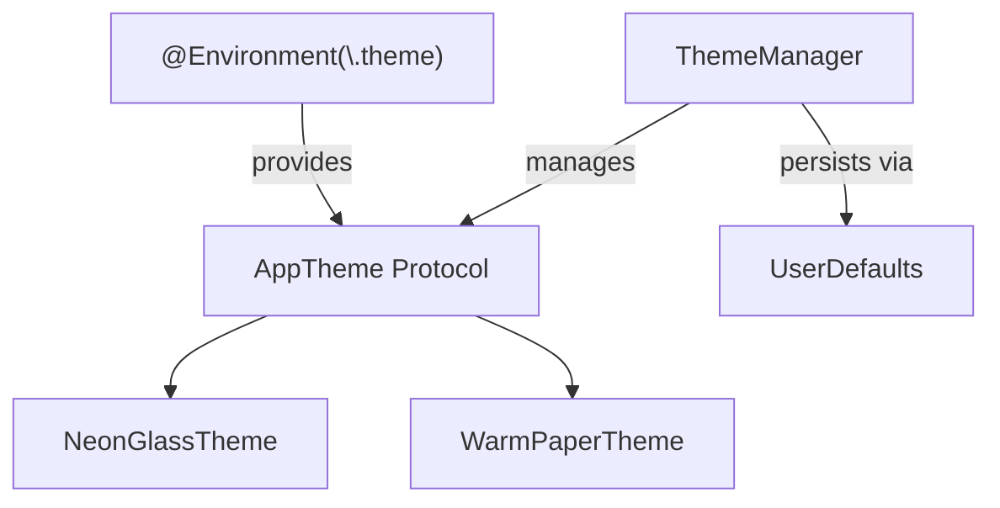

# llmHub Codebase Analysis

> Generated: December 11, 2025

---

## 1. Message Rendering

### Key Files

| Component      | Path                                                                                                     |
| -------------- | -------------------------------------------------------------------------------------------------------- |
| Message Bubble | [`NeonMessageBubble.swift`](file:///Users/hansaxelsson/llmHub/llmHub/Views/Chat/NeonMessageBubble.swift) |
| Chat View      | [`NeonChatView.swift`](file:///Users/hansaxelsson/llmHub/llmHub/Views/Chat/NeonChatView.swift)           |
| Input Panel    | [`ChatInputPanel.swift`](file:///Users/hansaxelsson/llmHub/llmHub/Views/Chat/ChatInputPanel.swift)       |

### How Content is Displayed

Messages are rendered using **plain SwiftUI `Text` views**:

```swift
Text(message.content)
    .font(isUser ? theme.bodyFont : theme.responseFont)
    .foregroundColor(theme.textPrimary)
    .textSelection(.enabled)
```

Two visual styles are supported, controlled by `theme.usesGlassEffect`:

- **Glass morphism** — Uses `.glassEffect()` modifier with tint colors
- **Solid background** — Uses `RoundedRectangle` with theme colors

### Markdown Parsing

> [!WARNING] > **Not found.** Messages display as raw text without any markdown parsing or formatting library.

`AttributedString` is only used in `TerminalOutputView.swift` for ANSI escape code parsing, not for chat messages.

---

## 2. Streaming Implementation

### Key Files

| Component               | Path                                                                                                              |
| ----------------------- | ----------------------------------------------------------------------------------------------------------------- |
| ViewModel (state)       | [`ChatViewModel.swift`](file:///Users/hansaxelsson/llmHub/llmHub/ViewModels/ChatViewModel.swift)                  |
| Service (orchestration) | [`ChatService.swift`](file:///Users/hansaxelsson/llmHub/llmHub/Services/ChatService.swift)                        |
| Throttling utility      | [`AsyncStream+Throttling.swift`](file:///Users/hansaxelsson/llmHub/llmHub/Utilities/AsyncStream+Throttling.swift) |

### Mechanism

Streaming uses **`AsyncThrowingStream<ProviderEvent, Error>`**:

```swift
func streamCompletion(for session: ChatSession, userMessage: String, images: [Data] = [])
    async throws -> AsyncThrowingStream<ProviderEvent, Error>
```

### State Management

State lives in `ChatViewModel` (an `@Observable @MainActor` class):

| Property                  | Type                      | Purpose                                          |
| ------------------------- | ------------------------- | ------------------------------------------------ |
| `isGenerating`            | `Bool`                    | Prevents double-sends, controls UI loading state |
| `streamingText`           | `String?`                 | Accumulated text buffer for live display         |
| `streamingMessageID`      | `UUID?`                   | Identifier for current streaming message         |
| `streamingStartedAt`      | `Date?`                   | Timestamp for streaming message                  |
| `streamingDisplayMessage` | `ChatMessage?` (computed) | Ready-to-render message object                   |

### Throttling

UI updates are throttled to **300ms** intervals:

```swift
for await text in uiStream.throttled(for: .milliseconds(300)) {
    self.streamingText = text
}
```

---

## 3. Provider Differences

### Key Files

| Provider   | Implementation                                                                                          | Manager                                                                                                 |
| ---------- | ------------------------------------------------------------------------------------------------------- | ------------------------------------------------------------------------------------------------------- |
| Anthropic  | [`AnthropicProvider.swift`](file:///Users/hansaxelsson/llmHub/llmHub/Support/AnthropicProvider.swift)   | [`AnthropicManager.swift`](file:///Users/hansaxelsson/llmHub/llmHub/Providers/AnthropicManager.swift)   |
| Google AI  | [`GoogleAIProvider.swift`](file:///Users/hansaxelsson/llmHub/llmHub/Support/GoogleAIProvider.swift)     | [`GeminiManager.swift`](file:///Users/hansaxelsson/llmHub/llmHub/Providers/GeminiManager.swift)         |
| OpenAI     | [`OpenAIProvider.swift`](file:///Users/hansaxelsson/llmHub/llmHub/Support/OpenAIProvider.swift)         | [`OpenAIManager.swift`](file:///Users/hansaxelsson/llmHub/llmHub/Providers/OpenAIManager.swift)         |
| Mistral    | [`MistralProvider.swift`](file:///Users/hansaxelsson/llmHub/llmHub/Support/MistralProvider.swift)       | [`MistralManager.swift`](file:///Users/hansaxelsson/llmHub/llmHub/Providers/MistralManager.swift)       |
| xAI        | [`XAIProvider.swift`](file:///Users/hansaxelsson/llmHub/llmHub/Support/XAIProvider.swift)               | [`XAIManager.swift`](file:///Users/hansaxelsson/llmHub/llmHub/Providers/XAIManager.swift)               |
| OpenRouter | [`OpenRouterProvider.swift`](file:///Users/hansaxelsson/llmHub/llmHub/Support/OpenRouterProvider.swift) | [`OpenRouterManager.swift`](file:///Users/hansaxelsson/llmHub/llmHub/Providers/OpenRouterManager.swift) |

### Streaming Comparison

| Provider       | max_tokens                                          | Streaming Format                                                                               |
| -------------- | --------------------------------------------------- | ---------------------------------------------------------------------------------------------- |
| **Anthropic**  | Explicit `max_tokens` in request                    | SSE with `event:` + `data:` lines. Handles `content_block_start`, `content_block_delta` events |
| **Google AI**  | Uses model's `outputTokenLimit` (no explicit param) | Converts `:generateContent` → `:streamGenerateContent`. Parses `data:` lines                   |
| **OpenAI**     | `max_tokens` via CodingKey                          | Standard OpenAI SSE format                                                                     |
| **Mistral**    | `max_tokens` via CodingKey                          | OpenAI-compatible SSE                                                                          |
| **xAI**        | `max_tokens: Int?`                                  | OpenAI-compatible format                                                                       |
| **OpenRouter** | `max_tokens` via CodingKey                          | OpenAI-compatible format                                                                       |

### Stop Conditions

> [!NOTE] > **`stop_sequences` not found** in any provider implementation.

---

## 4. Current Theming

### Key Files

| Component   | Path                                                                                          |
| ----------- | --------------------------------------------------------------------------------------------- |
| Protocol    | [`Theme.swift`](file:///Users/hansaxelsson/llmHub/llmHub/Theme/Theme.swift)                   |
| Manager     | [`ThemeManager.swift`](file:///Users/hansaxelsson/llmHub/llmHub/Theme/ThemeManager.swift)     |
| Glass Theme | [`NeonGlassTheme.swift`](file:///Users/hansaxelsson/llmHub/llmHub/Theme/NeonGlassTheme.swift) |
| Paper Theme | [`WarmPaperTheme.swift`](file:///Users/hansaxelsson/llmHub/llmHub/Theme/WarmPaperTheme.swift) |

### Architecture



### Theme Protocol Properties

- **Colors:** `backgroundPrimary`, `surface`, `textPrimary`, `accent`, `success`, `warning`, `error`
- **Typography:** `bodyFont`, `responseFont`, `monoFont`, `headingFont`
- **Effects:** `usesGlassEffect`, `shadowStyle`, `cornerRadius`, `borderWidth`

### Color Definition

Colors are defined **in Swift code** using a `Color(hex:)` extension. No Asset catalog is used for main theme colors.

---

## 5. Summary of Key File Locations

| Category              | Files                                                                                                                                                                                                     |
| --------------------- | --------------------------------------------------------------------------------------------------------------------------------------------------------------------------------------------------------- |
| **Message UI**        | `Views/Chat/NeonMessageBubble.swift`, `Views/Chat/ChatInputPanel.swift`                                                                                                                                   |
| **Chat View**         | `Views/Chat/NeonChatView.swift`, `Views/Chat/NeonToolbar.swift`                                                                                                                                           |
| **Streaming Logic**   | `ViewModels/ChatViewModel.swift`, `Services/ChatService.swift`, `Utilities/AsyncStream+Throttling.swift`                                                                                                  |
| **Providers**         | `Support/AnthropicProvider.swift`, `Support/GoogleAIProvider.swift`, `Support/OpenAIProvider.swift`, `Support/MistralProvider.swift`, `Support/XAIProvider.swift`, `Support/OpenRouterProvider.swift`     |
| **Provider Managers** | `Providers/AnthropicManager.swift`, `Providers/GeminiManager.swift`, `Providers/OpenAIManager.swift`, `Providers/MistralManager.swift`, `Providers/XAIManager.swift`, `Providers/OpenRouterManager.swift` |
| **Theme System**      | `Theme/Theme.swift`, `Theme/ThemeManager.swift`, `Theme/NeonGlassTheme.swift`, `Theme/WarmPaperTheme.swift`                                                                                               |

---

## Key Findings

| Area                   | Status             | Notes                                                 |
| ---------------------- | ------------------ | ----------------------------------------------------- |
| Markdown rendering     | ⚠️ **Missing**     | Messages display as plain text                        |
| Streaming architecture | ✅ **Robust**      | `AsyncThrowingStream`-based, unified across providers |
| Provider protocol      | ✅ **Unified**     | `LLMProvider` protocol with `streamResponse()`        |
| Theme system           | ✅ **Complete**    | Protocol-based with SwiftUI environment injection     |
| Loading state          | ✅ **Implemented** | `isGenerating` flag in `ChatViewModel`                |
